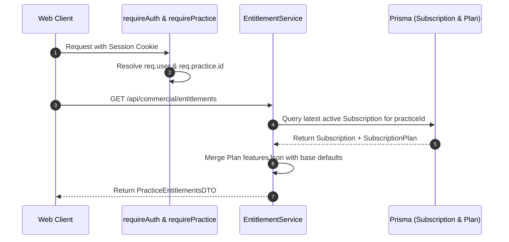

# VetRx Phase 10 — Entitlement Architecture

**Version**: 1.0  
**Domain**: Access Control, Feature Gating & Usage Governance  

---

## 1. Architectural Principles

1. **Centralized Entitlement Resolution**: Feature access must never be decided by scattering ad-hoc plan checks across controllers (e.g. `if (practice.plan === 'PRO')`). All capability inquiries pass through a single, authoritative `EntitlementService`.
2. **Practice-Scoped Authority**: Entitlements are evaluated exclusively for the authenticated `Practice`. Individual users inherit entitlements based on their active practice membership.
3. **Decoupled from Clinical Controllers in Phase 10**: To guarantee zero regression on the existing production system, the Phase 10 `EntitlementService` defaults to granting full, unrestricted clinical access (`unrestricted: true`). No clinical routes are gated or blocked in Phase 10.
4. **Client Cannot Dictate Entitlements**: Any capability flags rendered in the frontend are strictly for UX responsiveness (e.g. showing/hiding menu options). The backend API retains complete authorization authority.

---

## 2. Entitlement Resolution Flow



---

## 3. Entitlement Structure (`PracticeEntitlementsDTO`)

The entitlement model specifies capabilities across clinical, financial, and administrative domains:

```typescript
export interface PracticeEntitlementsDTO {
  practiceId: string;
  status: 'TRIAL' | 'ACTIVE' | 'PAST_DUE' | 'GRACE_PERIOD' | 'EXPIRED' | 'CANCELLED' | 'UNRESTRICTED';
  planCode: string;
  planName: string;
  features: {
    canCreatePatients: boolean;
    canCreatePrescriptions: boolean;
    canUseSmartDose: boolean;
    canUseTreatmentPackages: boolean;
    canCreateInvoices: boolean;
    canGeneratePdf: boolean;
    canExportData: boolean;
    maxUserSeats: number;
  };
  quotas: {
    activeSeatsCount: number;
    maxSeatsAllowed: number;
  };
  isReadOnly: boolean;
  expiresAt: string | null;
  gracePeriodEndsAt: string | null;
}
```

---

## 4. Phase 10 Baseline Implementation

During Phase 10:
- If a practice has a recorded `Subscription` in the database, `EntitlementService` resolves its entitlements based on the associated `SubscriptionPlan`.
- If a practice does **not** have an explicit `Subscription` record (which is the case for all 44 existing production practices prior to Phase 12/14 activation), `EntitlementService` falls back to a safe **UNRESTRICTED** entitlement profile with `isReadOnly: false`.
- **Zero Disruptive Enforcement**: Clinical controllers (`/api/owners`, `/api/patients`, `/api/prescriptions`, `/api/invoices`) do not enforce entitlement restrictions in Phase 10. Enforcement will be activated in Phase 14 after commercial launch preparation.
