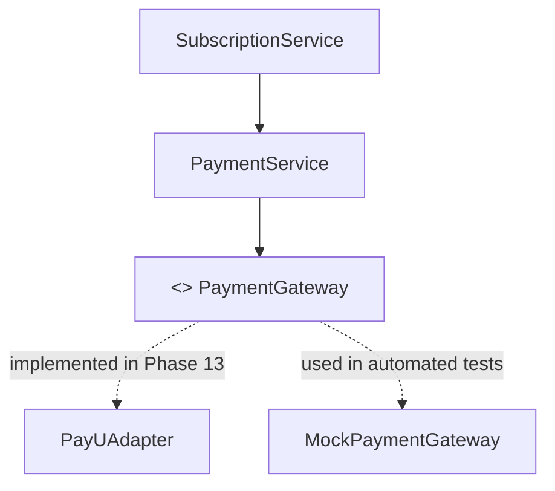

# VetRx Phase 10 — Payment Provider Boundary

**Version**: 1.0  
**Domain**: External Gateway Abstraction & PayU Integration Boundary  

---

## 1. Provider-Neutral Architecture

VetRx is designed with a provider-neutral payment boundary. The core commercial services (`CommercialAccountService`, `SubscriptionService`, `PaymentService`) never communicate directly with vendor-specific SDKs. Instead, they interact with a strongly-typed TypeScript interface: `PaymentGateway`.

In Phase 13, PayU will be implemented as a concrete provider (`PayUAdapter`) conforming to this interface.



---

## 2. The `PaymentGateway` Contract

Defined in `server/src/commercial/payment.provider.interface.ts`:

```typescript
export interface PaymentOrderRequest {
  practiceId: string;
  subscriptionId?: string;
  amountPaisa: number;
  currency: string; // "INR"
  customerName: string;
  customerEmail: string;
  customerPhone?: string;
  productInfo: string;
  returnUrl: string;
  cancelUrl: string;
}

export interface PaymentOrderResponse {
  internalReference: string;
  gatewayTransactionId?: string;
  redirectUrl?: string;
  formParameters?: Record<string, string>;
}

export interface VerifiedPaymentResult {
  isVerified: boolean;
  gatewayTransactionId: string;
  internalReference: string;
  amountPaisa: number;
  currency: string;
  status: 'SUCCESS' | 'FAILED' | 'PENDING';
  paymentMode?: string;
  rawPayload: Record<string, unknown>;
  errorMessage?: string;
}

export interface PaymentGateway {
  readonly providerName: string;

  createPaymentOrder(order: PaymentOrderRequest): Promise<PaymentOrderResponse>;
  
  verifyCallback(payload: Record<string, unknown>): Promise<VerifiedPaymentResult>;
  
  verifyWebhook(payload: Record<string, unknown>, signature?: string): Promise<VerifiedPaymentResult>;
  
  getPaymentStatus(gatewayTransactionId: string): Promise<VerifiedPaymentResult>;
}
```

---

## 3. Strict Phase 10 Non-Implementation Boundaries

To guarantee production security and architectural stability:

1. **NO PayU SDK or API Calls**: Zero PayU packages or HTTP client requests are included or executed in Phase 10.
2. **NO Live or Sandbox Credentials**: No `PAYU_MERCHANT_KEY` or `PAYU_MERCHANT_SALT` environment variables are required or stored in Phase 10.
3. **NO Client-Side Payment Buttons or Checkouts**: No frontend checkout widgets, card forms, or PayU redirect handlers are created in Phase 10.
4. **NO Inbound Webhook Endpoints**: Inbound gateway callback routes (`/api/billing/webhook/payu`) belong to Phase 13.
5. **Authoritative Server Verification Rule**: When implemented in Phase 13, all payment state transitions must be verified via cryptographic reverse-hash calculations on the backend. Browser redirect parameters will never be trusted to activate subscriptions.
