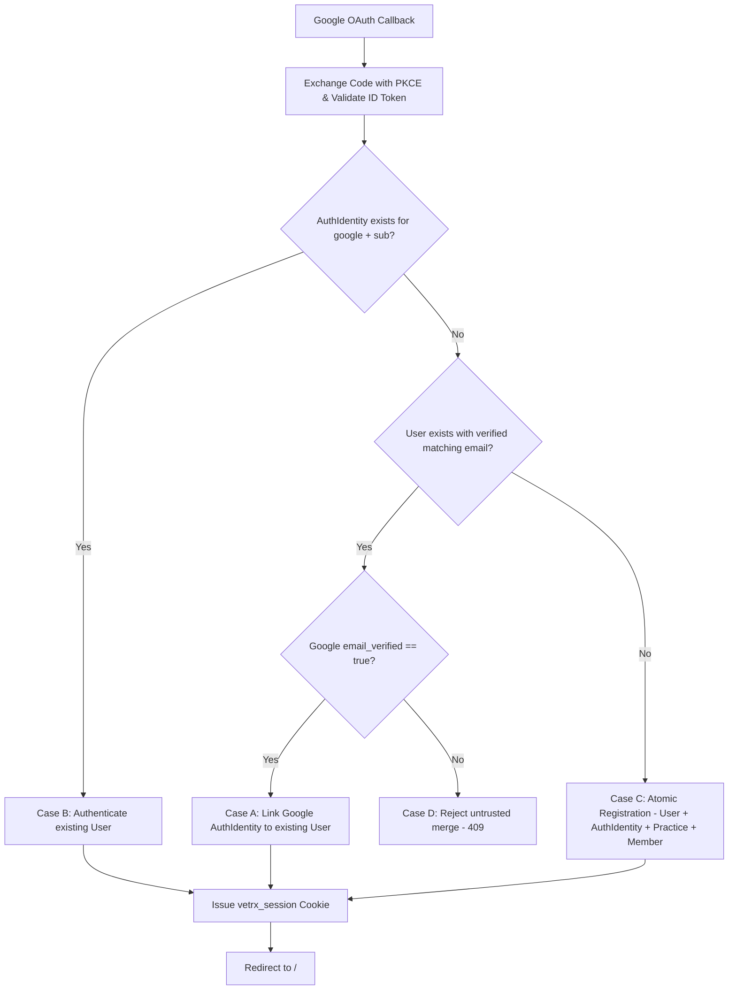

# VetRx Phase 11 — Google Authentication & Account Management Architecture

**Author**: Antigravity SaaS Platform Architect  
**Phase**: Phase 11 — Google Authentication & Account Management  
**Status**: Authoritative Architectural Design  
**Date**: September 20, 2026  

---

## 1. Executive Overview

VetRx requires production-ready dual authentication:
1. **Email + Password Authentication**: Existing standard credential flow using salted bcrypt hashes.
2. **Google OAuth 2.0 / OpenID Connect**: Server-side authorization code flow with PKCE, state validation, and cryptographically verified claims.

Both authentication mechanisms resolve deterministically to **ONE underlying VetRx account**:

```
User (email, normalizedEmail, passwordHash?, emailVerified)
  ├── AuthIdentity (provider: "password", providerUserId: normalizedEmail)
  └── AuthIdentity (provider: "google", providerUserId: googleSub)
            │
            ▼
      PracticeMember (role: PRACTICE_OWNER / ADMIN / STAFF)
            │
            ▼
         Practice (The Commercial Tenant)
```

---

## 2. Codebase Audit Summary

### Database Schema (`prisma/schema.prisma`)
- `User`: Primary identity entity. Fields: `id`, `email`, `normalizedEmail`, `name`, `avatarUrl`, `emailVerified`, `passwordHash` (nullable for OAuth-only users), `isActive`.
- `AuthIdentity`: Multi-provider identity mapping. Fields: `id`, `userId`, `provider` ('password', 'google'), `providerUserId` (Google `sub` or normalized email), `providerEmail`. Unique constraint on `@@unique([provider, providerUserId])`.
- `Session`: Token-based session tracking with SHA-256 hashed tokens (`sessionTokenHash`) and expiration timestamps.
- `Practice`: Primary tenant boundary.
- `PracticeMember`: Joins `User` to `Practice` with role-based access.

### Existing Strengths
- `AuthIdentity` model already supports multi-provider mappings with unique indexes.
- `AuthService.registerWithPassword` and `AuthService.loginWithPassword` are robust, rate-limited, and audited.
- `SessionService` issues secure `vetrx_session` HTTP-only cookies.
- Google OAuth provider scaffolding exists in `server/src/auth/google.provider.ts`.

### Gaps Addressed in Phase 11
1. **Deterministic Account Linking**: Replace the strict collision block in `AuthService.handleOAuthIdentity` with verified email matching (Case A) and safe linking.
2. **PKCE & State Hardening**: Implement PKCE (`code_challenge` / `code_verifier`) and state cookie validation.
3. **ID Token Verification**: Validate Google `id_token` issuer, audience, subject, and expiration.
4. **Account Management Endpoints**: Expose `/api/auth/identities`, `/api/auth/password/set`, and `/api/auth/identities/google` unlinking.
5. **Frontend Account & Security UI**: Add an Account Management section in `SettingsPage` displaying connected authentication methods and password status.
6. **Dashboard Wording Alignment**: Update dashboard status to `Secure Cloud • Online` and heading to `Clinical Practice Command Center`.

---

## 3. Deterministic Account Matching & Linking Rules

When a user authenticates via Google:



### Rule Details:
- **Case A (Existing Password Account + Matching Verified Google Email)**:
  - Locate existing `User` by `normalizedEmail`.
  - Confirm Google returned `email_verified: true`.
  - Create `AuthIdentity(provider: 'google', providerUserId: sub, userId: user.id)`.
  - If `user.emailVerified` was false, update it to true.
  - Issue standard `vetrx_session`. **Zero duplicate User, Practice, or Member created.**
- **Case B (Existing Google Identity)**:
  - AuthIdentity matching `provider: 'google'` and `providerUserId: sub` located.
  - Authenticate existing `User`, issue standard session.
- **Case C (Completely New User)**:
  - No existing Google identity, no existing email match.
  - In an atomic Prisma transaction, create `User`, `AuthIdentity(google)`, `Practice`, `PracticeMember(PRACTICE_OWNER)`, `PracticeSettings`.
  - Issue standard `vetrx_session`.
- **Case D (Unverified Email Collision)**:
  - If Google reports `email_verified: false`, reject automatic linking (`409 ACCOUNT_COLLISION`).

---

## 4. Security & Tenant Invariants

1. **Session Uniformity**: Both Google and password logins issue the identical `vetrx_session` cookie format.
2. **Tenant Isolation**: Practice tenancy is always derived server-side via `PracticeMember`. Google metadata is never used to determine or override tenant access.
3. **Secret Isolation**: Google Client Secret remains strictly on the backend.
4. **Account Unlink Guard**: A user cannot unlink their Google identity if they do not have a password configured (`hasPassword: false`), preventing account lockout.
