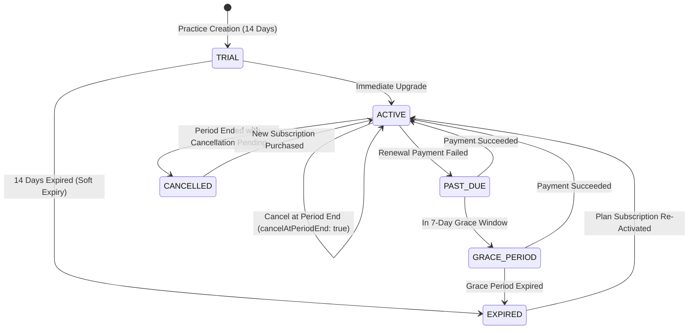

# VetRx — Phase 12 Subscription Lifecycle & State Machine

## 1. Subscription State Machine

VetRx implements a deterministic, finite state machine governing subscription lifecycles across trials, paid tiers, payment failures, and cancellations.



---

## 2. Transition Rules & Operational Behaviors

### 2.1 Upgrade Behavior
- **Timing**: Immediate upon selection.
- **State Change**:
  - If upgrading from `TRIAL` or `EXPIRED`: subscription status transitions immediately to `ACTIVE`.
  - Quotas (patients, packages, custom medicines) immediately become unlimited.
  - Practitioner seat limits adjust immediately (e.g., from 1 vet to 5 vets when moving to Clinic).

### 2.2 Downgrade Behavior & Invariant Validation
- **Timing**: Scheduled for period end (`currentPeriodEnd`).
- **Downgrade Pre-Validation Invariant**:
  - When scheduling a downgrade from **Clinic** (up to 5 vets) to **Individual** (1 vet), the system actively audits current practice seats.
  - If the practice has **more than 1 active veterinarian**, the downgrade is **rejected immediately**:
    ```json
    {
      "statusCode": 400,
      "errorCode": "DOWNGRADE_LIMITS_EXCEEDED",
      "message": "Cannot downgrade to Individual Plan while having 3 active veterinarians. Please remove additional veterinarians in Practice Settings before downgrading."
    }
    ```
  - This prevents practices from locking themselves into an invalid state at renewal.

### 2.3 Cancellation Behavior
- **Non-Destructive**: Voluntary cancellation sets `cancelAtPeriodEnd = true`.
- **Continued Access**: The practice retains 100% active access to all features until `currentPeriodEnd`.
- **Reversal / Reactivation**: At any time before `currentPeriodEnd`, the practice administrator can reverse the cancellation with one click, restoring standard automatic renewal.

### 2.4 Grace Period & Soft Expiry
- **Grace Window**: Exactly 7 calendar days following renewal payment failure or trial expiration.
- **Grace Access**: During the 7-day grace window (`PAST_DUE` / `GRACE_PERIOD`), clinical operations remain operational to prevent disrupting veterinary patient care.
- **Soft Expiry Execution**:
  - Once the 7-day grace window elapses without payment, status transitions to `EXPIRED`.
  - **Zero clinical data is deleted**. All historical records, prescriptions, PDFs, and invoices remain fully searchable, readable, and exportable.
  - New record creation is paused until a subscription is activated.

---

## 3. Server-Side Status Evaluator

The `SubscriptionService.evaluateSubscriptionStatus()` method provides a deterministic server-side evaluator that inspects timestamps and calculates the current authoritative status without depending on asynchronous external webhooks.
