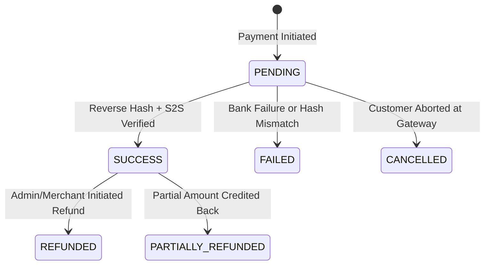

# VetRx — Phase 13 Payment Lifecycle & State Machine

## 1. End-to-End Payment Sequence

```
Practitioner                    VetRx Web/Server                       PayU Gateway
    │                                  │                                     │
    │ 1. Selects Plan (e.g. Clinic Mo) │                                     │
    ├─────────────────────────────────>│                                     │
    │                                  │ 2. Compute price (149900 paise)     │
    │                                  │    Create Payment (PENDING)         │
    │                                  │    Generate SHA-512 Request Hash    │
    │                                  │                                     │
    │ 3. Form parameters returned      │                                     │
    │<─────────────────────────────────┤                                     │
    │                                  │                                     │
    │ 4. Auto-submit form POST         │                                     │
    ├──────────────────────────────────┼────────────────────────────────────>│
    │                                  │                                     │
    │                                  │    5. Customer pays (UPI/Card)      │
    │                                  │       PayU processes transaction    │
    │                                  │                                     │
    │ 6. Browser redirect (SURL)       │                                     │
    │<─────────────────────────────────┼─────────────────────────────────────┤
    │                                  │                                     │
    │ 7. POST /payments/verify         │                                     │
    ├─────────────────────────────────>│                                     │
    │                                  │ 8. Validate reverse SHA-512 hash    │
    │                                  │ 9. S2S verify_payment query         │
    │                                  │<───────────────────────────────────>│
    │                                  │ 10. Record PaymentEvent (idempotent)│
    │                                  │ 11. Payment -> SUCCESS              │
    │                                  │ 12. Subscription -> ACTIVE          │
    │                                  │ 13. Elevate Entitlement Quotas      │
    │                                  │                                     │
    │ 14. Render Success & Dashboard   │                                     │
    │<─────────────────────────────────┤                                     │
```

---

## 2. Payment Record State Machine



### State Definitions
- **`PENDING`**: Payment record created with an authoritative price snapshot and unique `txnid`. Awaiting completion.
- **`SUCCESS`**: Payment confirmed by reverse hash AND PayU `verify_payment` response. Subscription immediately updated.
- **`FAILED`**: Explicit gateway decline, invalid credentials, or cryptographic hash tampering detected.
- **`CANCELLED`**: Practitioner exited the PayU hosted page without providing payment credentials.
- **`REFUNDED`**: Full original payment credited back via merchant portal or refund API.

---

## 3. Subscription Interaction & Transition Invariants

### 3.1 First Paid Activation (Trial -> Active)
- Subscription status changes from `TRIAL` to `ACTIVE`.
- `currentPeriodStart`: Current timestamp.
- `currentPeriodEnd`: Exactly +1 calendar month (for monthly plans) or +1 calendar year (for annual plans).
- Introductory trial quotas (10 patients, 5 records/patient) are lifted; practice receives unlimited patient creation.

### 3.2 Plan Upgrade (e.g. Individual -> Clinic)
- Immediate upgrade (BD-15).
- Takes effect the instant payment is confirmed as `SUCCESS`.
- Max veterinarian seats increased from 1 to 5.
- Reset billing period start and end based on the new tier.

### 3.3 Renewal Succeeded (Active -> Active)
- `currentPeriodStart` advanced to previous `currentPeriodEnd`.
- `currentPeriodEnd` extended by +1 month or +1 year.
- Clinical access continues seamlessly with zero interruption.

### 3.4 Renewal Payment Failed (Active -> Past Due -> Grace Period -> Expired)
- Transition path: `ACTIVE` -> `PAST_DUE` -> `GRACE_PERIOD` (7 days) -> `EXPIRED`.
- During the 7-day grace period, all clinical tools, prescriptions, and patient records remain fully functional.
- Once grace period expires without successful payment, account enters **Soft Expiry**:
  - No clinical data is deleted.
  - All existing patients, consultations, and prescriptions remain readable and exportable as PDFs.
  - New record creation is blocked with HTTP 403 `SUBSCRIPTION_EXPIRED` until payment is completed.
