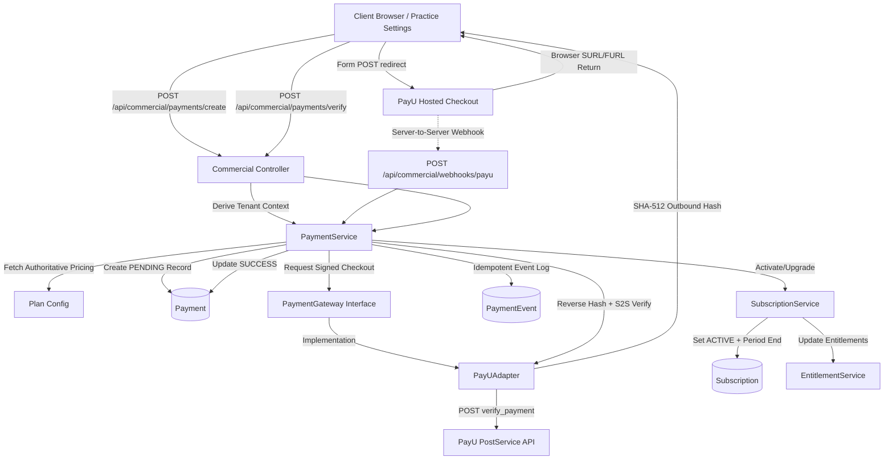

# VetRx — Phase 13 PayU Payment & Billing Architecture

## 1. Executive Summary

Phase 13 establishes the authoritative payment and billing engine for VetRx, integrating **PayU India** for Indian Rupee (INR) transactions. This integration operates directly on top of the Phase 10 SaaS Commercial Foundation and Phase 12 Trial & Subscription Plan baselines.

The architectural boundary ensures that PayU-specific protocols remain strictly isolated behind the provider-neutral `PaymentGateway` interface. The core domain services (`SubscriptionService`, `EntitlementService`, `CommercialAccountService`) remain 100% agnostic to payment gateway implementation details.

---

## 2. Commercial Domain & Layered Boundary

### Key Architectural Invariants
1. **Strict Decoupling**: PayU request formatting, response hashing, and API error codes reside exclusively in `PayUAdapter` and `payu.crypto.ts`.
2. **Authoritative Server Pricing**: The payable amount is calculated on the server from `(practice, plan, billingInterval)` using integer minor units (paise). Client-submitted amounts are rejected.
3. **Defense-in-Depth Verification**: A browser return URL (`surl`) is never accepted as proof of payment. Every transaction must pass reverse SHA-512 hash validation AND authoritative server-to-server verification (`verify_payment`).
4. **Idempotent State Changes**: All provider events (callbacks or webhooks) are recorded in `PaymentEvent` with a unique database constraint on `[provider, eventId]`. Duplicate deliveries return HTTP 200 without executing duplicate subscription state transitions.

---

## 3. Data Model Integration

Phase 13 reuses the existing Prisma relational models without breaking migrations:

### 3.1 `Payment`
- `id`: Internal UUID primary key.
- `practiceId`: Scoped tenant practice ID.
- `subscriptionId`: Target practice subscription.
- `amountPaisa`: Integer minor units (e.g. `59900` for ₹599.00). Non-integers and floating-point numbers are prohibited.
- `currency`: Default `"INR"`.
- `status`: Lifecycle status: `PENDING` -> `SUCCESS` / `FAILED` / `CANCELLED`.
- `paymentProvider`: `"PAYU"`.
- `internalReference`: Unique transaction reference (`txnid`), format: `TXN-VRX-<timestamp>-<randomHex>`.
- `gatewayTransactionId`: PayU transaction reference (`mihpayid` / `payuMoneyId`).
- `paymentMethod`: Captured payment instrument (`UPI`, `CARD`, `NETBANKING`).
- `gatewayResponseRaw`: Complete JSON response payload (sanitized of sensitive secrets).

### 3.2 `PaymentEvent`
- `provider`: `"PAYU"`.
- `eventId`: External PayU transaction or webhook identifier.
- `eventType`: Event category (`PAYMENT_SUCCESS`, `PAYMENT_FAILED`, `WEBHOOK_RECEIVED`).
- `payloadHash`: SHA-256 hash of the inbound raw payload.
- `rawPayload`: Stored JSON payload.
- `processingStatus`: `"PROCESSED"`, `"DUPLICATE"`, or `"FAILED"`.
- **Constraint**: `@@unique([provider, eventId])` enforces deterministic idempotency.

---

## 4. Cryptographic Hash Architecture

PayU mandates strict SHA-512 message digest calculation using merchant credentials.

### 4.1 Outbound Request Hash (Payment Initiation)
Calculated server-side and sent with the hosted checkout redirect form:
$$\text{hash} = \text{SHA-512}(\text{key} \mid \text{txnid} \mid \text{amount} \mid \text{productinfo} \mid \text{firstname} \mid \text{email} \mid \text{udf1} \mid \text{udf2} \mid \text{udf3} \mid \text{udf4} \mid \text{udf5} \mid \mid \mid \mid \mid \mid \text{salt})$$
Where:
- `amount` is formatted as Rupees with 2 decimal places (e.g., `"599.00"`).
- `udf1` to `udf5` hold metadata (`practiceId`, `planCode`, `billingInterval`).
- After `udf5`, five empty pipes (`||||||`) represent unused `udf6` through `udf10`.

### 4.2 Inbound Response Hash (Callback / Return Verification)
When PayU posts the payment result back to the server:
- **Standard response**:
  $$\text{hash} = \text{SHA-512}(\text{salt} \mid \text{status} \mid \mid \mid \mid \mid \mid \text{udf5} \mid \text{udf4} \mid \text{udf3} \mid \text{udf2} \mid \text{udf1} \mid \text{email} \mid \text{firstname} \mid \text{productinfo} \mid \text{amount} \mid \text{txnid} \mid \text{key})$$
- **If `additionalCharges` is returned**:
  $$\text{hash} = \text{SHA-512}(\text{additionalCharges} \mid \text{salt} \mid \text{status} \dots \mid \text{key})$$

### 4.3 Server-to-Server Verification (`verify_payment`)
Authoritative verification query sent to PayU PostService API:
$$\text{hash} = \text{SHA-512}(\text{key} \mid \text{command} \mid \text{var1} \mid \text{salt})$$
Where `command = "verify_payment"` and `var1 = txnid`.

---

## 5. Subscription Lifecycle Transitions & Invariants

| Prior State | Payment Event | Destination State | Period End Calculation | Entitlement Quotas |
| :--- | :--- | :--- | :--- | :--- |
| `TRIAL` | `PAYMENT_SUCCESS` | `ACTIVE` | +1 calendar month / +1 year | Quotas elevated to unlimited patients |
| `ACTIVE` (Individual) | `PAYMENT_SUCCESS` (Clinic) | `ACTIVE` | Reset to +1 month / year | Vet seat limit elevated to 5 |
| `ACTIVE` | Renewal `PAYMENT_SUCCESS` | `ACTIVE` | Existing end date + 1 interval | Continued uninterrupted access |
| `ACTIVE` | Renewal `PAYMENT_FAILED` | `PAST_DUE` | Enters 7-day Grace Period | Full clinical access preserved |
| `PAST_DUE` | Grace Period Expired | `EXPIRED` | Unchanged | Soft expiry: read-only clinical data |
| `EXPIRED` | `PAYMENT_SUCCESS` | `ACTIVE` | +1 calendar month / +1 year | Write access instantly restored |

---

## 6. Environment Separation & Security Safeguards

1. **Environment Flag**: `PAYU_ENVIRONMENT` determines endpoints (`SANDBOX` vs. `PRODUCTION`).
2. **Production Gate**: `PAYU_ENABLE_LIVE_BILLING=false` default ensures zero accidental live transactions during staging and automated testing.
3. **Secret Redaction**: `PAYU_MERCHANT_SALT` is never logged, exposed to frontend, or returned in API responses.
4. **Zero Card Storage**: VetRx does not handle or store credit/debit card numbers, CVVs, or OTPs. All payment credential capture is hosted by PayU under PCI-DSS Level 1 compliance.
