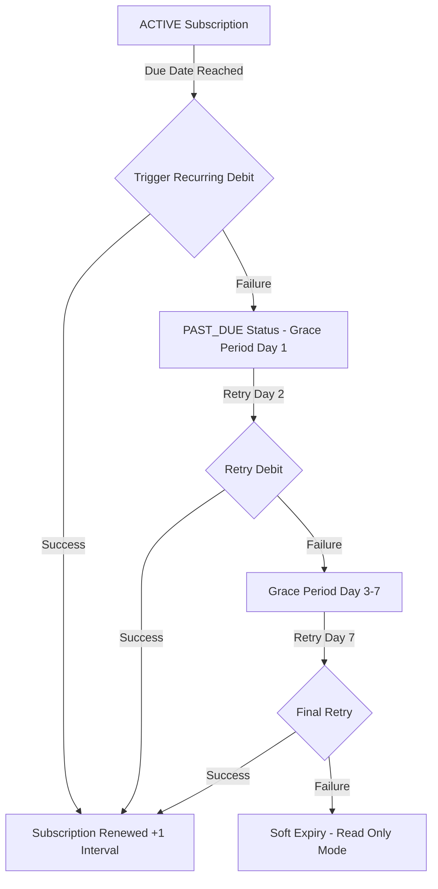

# VetRx — Phase 13 Recurring Billing & Mandate Architecture

## 1. Statutory & Regulatory Context (India RBI / NPCI Guidelines)

Recurring payments in India for software-as-a-service (SaaS) platforms operating in INR are strictly regulated by the Reserve Bank of India (RBI) e-mandate framework:
1. **Initial Registration with AFA**: The mandate registration requires customer Additional Factor Authentication (AFA) via OTP or UPI AutoPay application PIN approval.
2. **Pre-Debit Notification**: The merchant/gateway must dispatch an automated pre-debit SMS/email notification at least 24 to 48 hours before each scheduled recurring debit.
3. **Mandate Limit**: Transactions up to ₹15,000 (such as VetRx Clinic Monthly ₹1,499 or Annual ₹14,999) do not require secondary OTP during recurring execution if the mandate was authorized during setup.

---

## 2. PayU Recurring Mechanisms Evaluation

| Mechanism | Suitability for VetRx | User Experience | Operational Overhead |
| :--- | :--- | :--- | :--- |
| **UPI AutoPay** | **HIGH** (Preferred) | Instant authorization in PhonePe, GPay, Paytm | Automatic execution via PayU Subscription API |
| **Standing Instructions (SI) on Cards** | **MEDIUM** | Card mandate registration with ₹0/₹2 test debit | Periodic card expiry and bank re-authentication |
| **eNACH (NetBanking)** | **MEDIUM** | Bank mandate via NetBanking / debit card | Slower initial clearing; ideal for enterprise |

---

## 3. Trial-to-Subscription Payment Method Authorization (BD-01)

Business decision **BD-01** requires a payment method on file to start the 14-day trial:
- **Design Rule**: Practitioners MUST NOT be charged for subscription pricing during the 14-day introductory trial.
- **Implementation Strategy**:
  - In Sandbox and Production preview, the practice configures a mandate or payment token via PayU's authorization flow.
  - PayU registers the mandate token (`gatewaySubscriptionId` / `gatewayCustomerId`).
  - Upon completion of Day 14, VetRx schedules the first recurring charge of ₹599 (Individual) or ₹1,499 (Clinic).
  - If recurring automated debit is not activated by the merchant bank, VetRx falls back to **Pre-Renewal Invoice Notification**: sending a renewal checkout link 3 days prior to trial close, ensuring zero surprise charges.

---

## 4. Recurring Billing State Transitions & Retry Schedule

### Billing Trigger
1. An automated cron / background worker inspects subscriptions whose `currentPeriodEnd` is within 24 hours.
2. If an active recurring mandate exists (`gatewaySubscriptionId`), PayU's recurring debit API is triggered.
3. If payment succeeds, subscription period advances by 1 calendar month or 1 calendar year.

### Failure & Retry Policy
1. **Attempt 1 (Renewal Date)**: Payment failed $\longrightarrow$ Subscription marked `PAST_DUE`, 7-day grace period begins.
2. **Attempt 2 (Day +2)**: Automated retry.
3. **Attempt 3 (Day +4)**: Automated retry.
4. **Attempt 4 (Day +7)**: Final retry. If failed, subscription transitions to `EXPIRED`.

