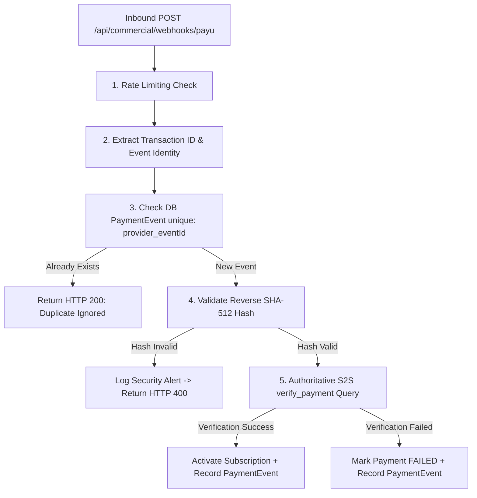

# VetRx — Phase 13 Webhook & Callback Security

## 1. Threat Model & Mitigation Strategy

Payment webhooks and browser redirect callbacks represent critical external boundaries vulnerable to multiple threat vectors:

| Threat Vector | Attack Scenario | VetRx Defense-in-Depth Mitigation |
| :--- | :--- | :--- |
| **Amount Tampering** | Attacker initiates ₹14,999 Clinic plan but intercepts request to send ₹1 to gateway | Server calculates price authoritatively in integer paise and verifies that returned amount equals `Payment.amountPaisa`. |
| **Status Spoofing** | Attacker invokes `/payments/return` directly with forged `status=success` | Request rejected immediately unless reverse SHA-512 hash matches AND PayU S2S `verify_payment` confirms success. |
| **Replay Attacks** | Attacker re-submits a previously valid webhook payload to re-activate or extend plan | Inbound `[provider, eventId]` unique constraint in `PaymentEvent` drops duplicate requests with HTTP 200 without duplicate execution. |
| **Cross-Tenant Attack** | Practice A attempts to verify or credit a payment belonging to Practice B | `verifyAndProcessPayment` enforces that `Payment.practiceId === req.practice.id`. |
| **Secret Exfiltration** | Merchant salt logged in application or debug logs | `payu.crypto.ts` strictly excludes secrets from log statements, error messages, and API responses. |

---

## 2. Webhook Authentication & Idempotency Pipeline



### Idempotency Enforcement Code Pattern
```typescript
const existing = await prisma.paymentEvent.findUnique({
  where: {
    provider_eventId: {
      provider: 'PAYU',
      eventId: gatewayTxnId,
    },
  },
});

if (existing) {
  logger.info(`Idempotent webhook delivery detected for ${gatewayTxnId} - skipping`);
  return { status: 'DUPLICATE_IGNORED' };
}
```

---

## 3. Rate Limiting & DoS Protection
The webhook endpoint is protected by Express Rate Limit:
- Window: 15 minutes.
- Max requests: 300 requests per IP block.
- Standard IP trust behind NGINX reverse proxy (`X-Forwarded-For`).
