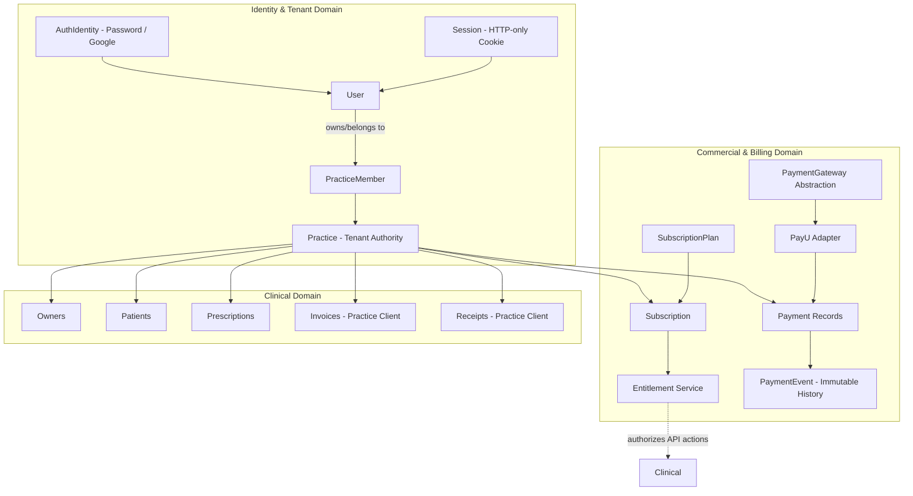
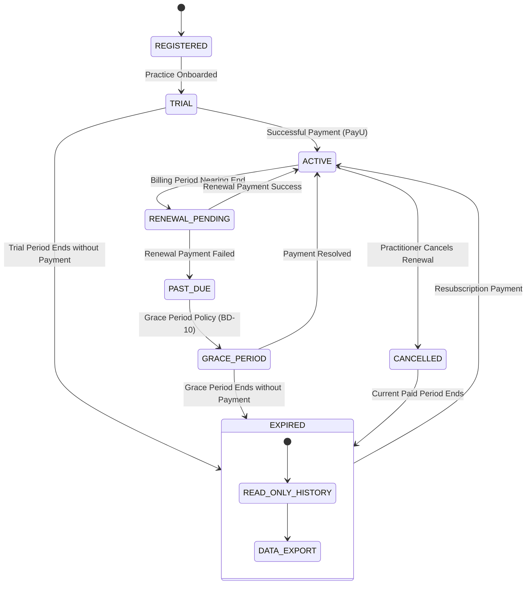
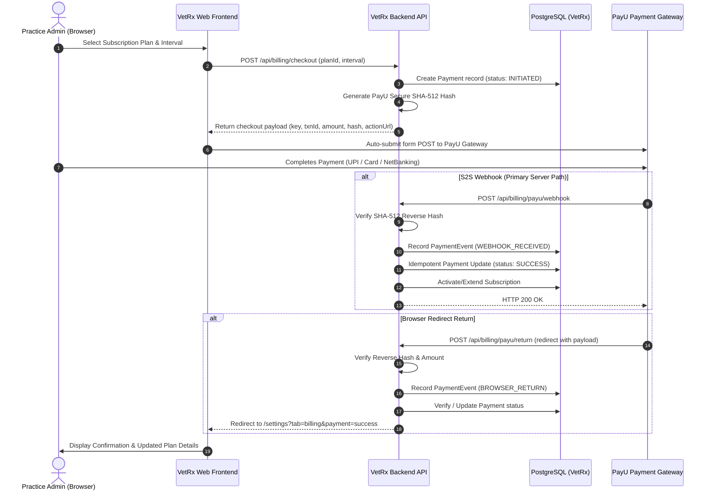

# VetRx Commercial SaaS Architecture

This document defines the architectural blueprints for commercializing VetRx as an independent veterinary SaaS product. It establishes the domain boundaries, data models, state machines, payment gateway abstractions, and security boundaries separating commercial operations from clinical practice data.

---

## 1. Domain Separation & High-Level Topology

VetRx maintains strict physical and logical separation between three operational domains:
1. **Identity & Tenant Domain**: `User`, `AuthIdentity`, `Session`, `Practice`, `PracticeMember`, `PracticeSettings`
2. **Clinical & Practice Domain**: `Owner`, `Patient`, `Medicine`, `TreatmentPackage`, `Prescription`, `PrescriptionItem`, `Invoice`, `InvoiceItem`, `Receipt`, `DocumentSequence`
3. **Commercial & Billing Domain**: `SubscriptionPlan`, `Subscription`, `Payment`, `PaymentEvent`, `Entitlement`



### Core Architecture Rules
1. **Clinical Data Independence**: Clinical records (`Prescription`, `Patient`, etc.) have **zero foreign keys** to `Subscription`, `Payment`, or `PayU`. They strictly reference `practiceId`.
2. **Payment Gateway Decoupling**: PayU is an external payment processor, not the database of record. VetRx maintains authoritative state for all plans, subscriptions, and financial logs.
3. **Server-Side Enforcement**: Entitlement checks are executed on the backend using Express middleware. Frontend UI controls adapt to entitlements for usability, but provide zero security authority.

---

## 2. Commercial Data Model (Conceptual Prisma Extension)

The target commercial schema cleanly extends the existing Prisma baseline without modifying clinical tables:

```prisma
// ==============================================================================
// Commercial & Billing Domain Models (Stage 10 / 12 / 13)
// ==============================================================================

enum SubscriptionStatus {
  TRIAL
  ACTIVE
  PAST_DUE
  GRACE_PERIOD
  CANCELLED
  EXPIRED
  SUSPENDED
}

enum BillingInterval {
  MONTHLY
  ANNUAL
}

enum PaymentStatus {
  INITIATED
  SUCCESS
  FAILED
  REFUNDED
  REVERSED
}

enum PaymentEventType {
  INITIATED
  CALLBACK_RECEIVED
  WEBHOOK_RECEIVED
  VERIFIED_SUCCESS
  VERIFIED_FAILURE
  RETRY_TRIGGERED
  REFUND_RECORDED
}

model SubscriptionPlan {
  id           String          @id @default(uuid())
  code         String          @unique // e.g. "SOLO_MONTHLY", "CLINIC_ANNUAL"
  name         String          // e.g. "Solo Practitioner"
  description  String?
  interval     BillingInterval
  pricePaisa   Int             // Exact integer paisa (e.g. 99900 = ₹999.00)
  currency     String          @default("INR")
  isActive     Boolean         @default(true)
  sortOrder    Int             @default(0)
  featuresJson Json            @default("{}") // Structured entitlement limits
  createdAt    DateTime        @default(now())
  updatedAt    DateTime        @updatedAt

  subscriptions Subscription[]
}

model Subscription {
  id                 String             @id @default(uuid())
  practiceId         String             @unique // 1 active subscription per practice
  practice           Practice           @relation(fields: [practiceId], references: [id], onDelete: Cascade)
  planId             String
  plan               SubscriptionPlan   @relation(fields: [planId], references: [id], onDelete: Restrict)
  status             SubscriptionStatus @default(TRIAL)
  trialStartsAt      DateTime?
  trialEndsAt        DateTime?
  currentPeriodStart DateTime           @default(now())
  currentPeriodEnd   DateTime
  cancelledAt        DateTime?
  cancelAtPeriodEnd  Boolean            @default(false)
  gracePeriodEndsAt  DateTime?
  createdAt          DateTime           @default(now())
  updatedAt          DateTime           @updatedAt

  payments           Payment[]

  @@index([status])
  @@index([currentPeriodEnd])
}

model Payment {
  id                   String        @id @default(uuid())
  practiceId           String
  practice             Practice      @relation(fields: [practiceId], references: [id], onDelete: Cascade)
  subscriptionId       String?
  subscription         Subscription? @relation(fields: [subscriptionId], references: [id], onDelete: SetNull)
  gateway              String        @default("PAYU") // Gateway abstraction identifier
  gatewayTransactionId String?       // mihpayid / txnId from PayU
  merchantReference    String        @unique // Unique internal order ID (e.g. "VETRX-ORD-20260920-001")
  amountPaisa          Int           // Exact integer paisa
  currency             String        @default("INR")
  status               PaymentStatus @default(INITIATED)
  paymentMode          String?       // "UPI", "CREDIT_CARD", "NET_BANKING", etc.
  gatewayResponseRaw   Json?         // Full raw verified callback payload for audit
  errorMessage         String?
  initiatedAt          DateTime      @default(now())
  completedAt          DateTime?
  createdAt            DateTime      @default(now())
  updatedAt            DateTime      @updatedAt

  events               PaymentEvent[]

  @@unique([gateway, gatewayTransactionId])
  @@index([practiceId])
  @@index([status])
}

model PaymentEvent {
  id         String           @id @default(uuid())
  paymentId  String
  payment    Payment          @relation(fields: [paymentId], references: [id], onDelete: Cascade)
  eventType  PaymentEventType
  source     String           // "BROWSER_RETURN", "S2S_WEBHOOK", "RECONCILIATION_WORKER"
  payload    Json?            // Event-specific details or raw webhook body
  createdAt  DateTime         @default(now())

  @@index([paymentId])
  @@index([eventType])
}
```

---

## 3. Subscription State Machine

The subscription lifecycle governs practice access across registration, trials, renewals, grace periods, and cancellations:



### State Definitions
- **TRIAL**: Initial period granting unmetered access to validate VetRx. Practice-bound to prevent multi-account abuse.
- **ACTIVE**: In good standing. Full entitlement access.
- **PAST_DUE**: Automated renewal failed or billing date passed. Warning banner rendered in UI.
- **GRACE_PERIOD**: Buffer period (e.g. 7 days) allowing the practice to resolve payment while retaining full clinical functionality.
- **CANCELLED**: Cancellation requested; account remains active until `currentPeriodEnd`.
- **EXPIRED**: Access to new record creation restricted. **Clinical records are preserved in read-only mode indefinitely.**
- **SUSPENDED**: Administrative hold (e.g., terms violation or dispute).

---

## 4. PayU Gateway Abstraction & Transaction Flow

To protect against vendor lock-in, PayU is integrated behind a generic `PaymentGateway` adapter:



### Server-Side Hash Verification
1. **Forward Hash** (Initiation):
   $$\text{hash} = \text{SHA512}(\text{KEY} \parallel \text{txnid} \parallel \text{amount} \parallel \text{productinfo} \parallel \text{firstname} \parallel \text{email} \parallel \text{udf1} \dots \parallel \text{SALT})$$
2. **Reverse Hash** (Return/Webhook Verification):
   $$\text{reverseHash} = \text{SHA512}(\text{SALT} \parallel \text{status} \parallel \dots \parallel \text{udf1} \parallel \text{email} \parallel \text{firstname} \parallel \text{productinfo} \parallel \text{amount} \parallel \text{txnid} \parallel \text{KEY})$$
3. Verification rule: If `calculatedHash !== receivedHash`, the payload is rejected with `400 BAD_REQUEST`, logged as a security alert, and the payment is marked `FAILED`.

---

## 5. Centralized Entitlement Engine

The `EntitlementService` acts as the single authority for feature access and operational quotas:

```typescript
export interface PracticeEntitlements {
  canCreatePrescription: boolean;
  canCreateInvoice: boolean;
  canPrintDocuments: boolean;
  canExportData: boolean;
  canManageTreatmentPackages: boolean;
  maxUserSeats: number;
  maxPatients: number | null; // null = unlimited
  isReadOnly: boolean;
  daysRemainingInTrial?: number;
}
```

### Middleware Integration
```typescript
// Example backend route protection
clinicalRouter.post(
  '/clinical/prescriptions',
  authenticateSession,
  requireEntitlement('canCreatePrescription'),
  createPrescriptionHandler
);
```

If a practice's subscription is `EXPIRED`, `requireEntitlement('canCreatePrescription')` returns:
```json
{
  "statusCode": 403,
  "code": "SUBSCRIPTION_REQUIRED",
  "message": "Your practice subscription has expired. Please renew your subscription to create new prescriptions.",
  "details": {
    "currentStatus": "EXPIRED",
    "renewalUrl": "/settings?tab=billing"
  }
}
```
Existing clinical GET routes (`/api/clinical/prescriptions`, `/api/clinical/prescriptions/:id`, PDF generation) remain accessible in read-only mode.
