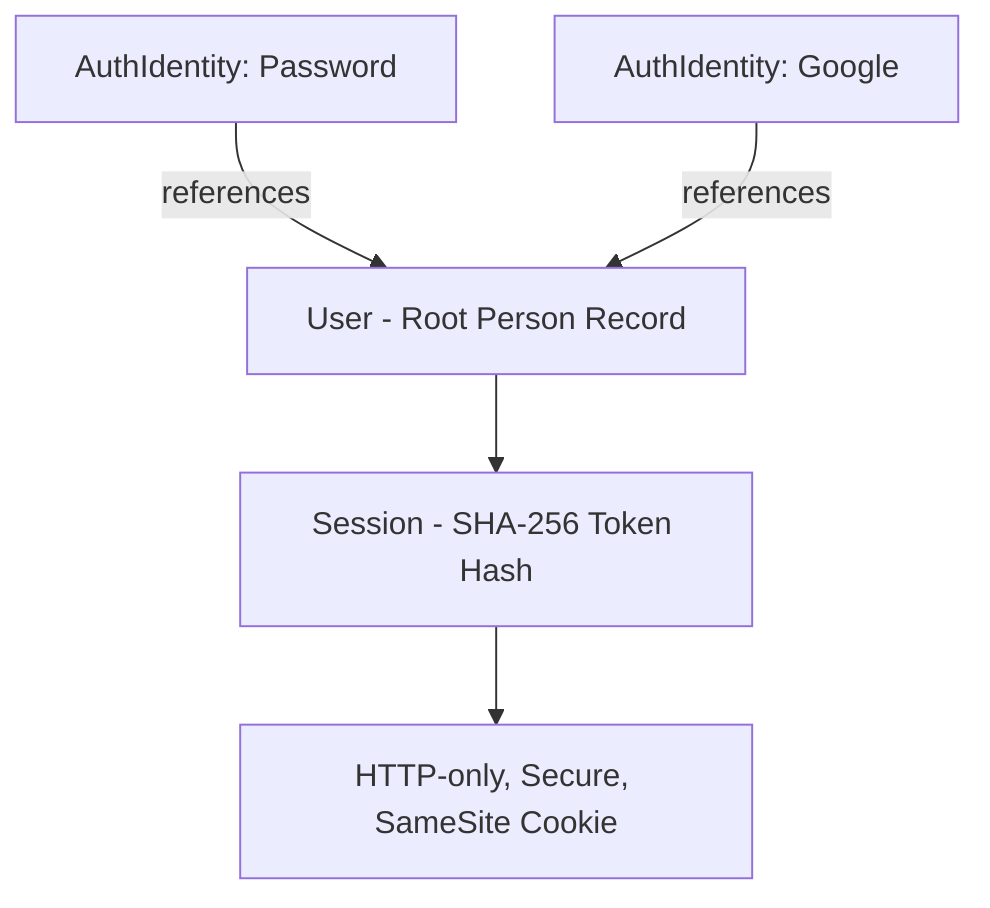
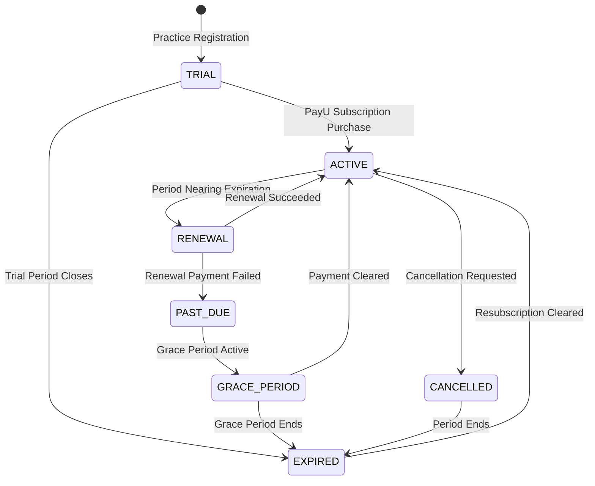

# VetRx Master Product & Commercial Roadmap v1.0

---

## 1. Product Vision

VetRx is an independent, secure, multi-tenant veterinary practice-management SaaS platform engineered specifically for veterinary practitioners, companion animal clinics, and ambulatory livestock practices. VetRx streamlines clinical consultations, species-aware signalment, deterministic dosage calculations, treatment package protocols, statutory tax invoicing, receipt issuance, and tamper-resistant prescription generation.

The commercial evolution transitions VetRx from a hardened veterinary clinical application into a commercially sustainable, subscription-based SaaS product. Throughout this evolution, VetRx adheres to five foundational pillars:
1. **Clinical Authority & Practice Independence**: VetRx operates as an autonomous veterinary platform with zero mandatory dependencies on external veterinary associations.
2. **Strict Multi-Tenant Isolation**: Practice data is strictly partitioned server-side.
3. **Decoupled Architecture**: Commercial billing, subscriptions, and payment gateways exist as an independent domain layered over practice tenancy, without modifying or complicating clinical workflows.
4. **Authoritative Server Enforcement**: Security and entitlements are enforced strictly on the backend.
5. **Preservation of Frozen Baselines**: The manually accepted Phase 4 UI design and Phase 5 PDF/Print layouts remain frozen baselines.

---

## 2. Current Product Status

- **Current Lifecycle State**: **Phase 8 (Release Candidate & Controlled Pilot) — COMPLETE (PASS)**
- **Next Lifecycle Phase**: **Phase 9 — Production Launch & Stabilization (STATUS: READY)**
- **Current Release Candidate**: `v0.8.0-rc.1`
- **Git Commit SHA**: `f696837`
- **Production Environment**: `https://vetrx.adcpmalappuram.in`
- **Production Health**: `https://vetrx.adcpmalappuram.in/api/ready` $\longrightarrow$ `HTTP 200 OK` (`status: "ready"`, `database: "connected"`)
- **Automated Regression State**:
  - Frontend Tests: **14 / 14 PASS**
  - Backend Tests: **29 / 29 PASS**
  - Phase 6 Integration Matrix: **29 / 29 PASS**
  - Phase 8 Pilot Validation Suite: **10 / 10 PASS**
  - Production Web Build: **PASS (0 errors, 706ms)**
- **Release Gate Quality**:
  - Open P0 Defects: **0**
  - Open P1 Defects: **0**
  - Open P2 Defects: **0**
  - Open P3 Defects: **0**
  - Section 22 Directions Suppression: **PASS**
  - Multi-Tenant Scoping: **PASS**
  - Print / Save PDF Parity: **PASS**

---

## 3. Completed Phases 0–8

| Phase | Title | Focus & Core Milestones | Formal Status |
| :--- | :--- | :--- | :---: |
| **Phase 0** | Foundation | Monorepo structure, TypeScript, Vite React SPA, Express backend, Prisma ORM, PostgreSQL schema | **COMPLETE** |
| **Phase 1** | Backend / Database / Infrastructure | REST API endpoints, Drizzle/Prisma schema migrations, Docker Compose environment, VPS production setup | **COMPLETE** |
| **Phase 2** | Authentication / Security / Tenant Isolation | Session management, SHA-256 session token hashing, HTTP-only cookies, practice-level tenant scoping | **COMPLETE** |
| **Phase 3** | Clinical Functionality | Owners, Patients, Medicines formulary, Prescriptions builder, Smart Dose Calculator, Treatment Packages | **COMPLETE** |
| **Phase 4** | Design / UX | Design tokens, responsive grid, mobile-adaptive forms, AppShell navigation, clinical accessibility | **FROZEN** |
| **Phase 5** | PDF / Print / Save PDF | Authority DocumentViewer, print styles, html2canvas/jsPDF Save PDF parity, indivisible signature block | **FROZEN** |
| **Phase 6** | Full Integration & UAT | Comprehensive 29-point end-to-end integration test suite, cross-module workflows, user acceptance | **PASS** |
| **Phase 7** | Production Hardening & Recovery | VPS deployment hardening, NGINX SSL reverse proxy, automated backup/restore runbooks, failure recovery drills | **FROZEN** |
| **Phase 8** | Release Candidate & Controlled Pilot | Real-world practice validation (Accounts A, B, C), multi-viewport testing, Section 22 suppression verification | **PASS** |

---

## 4. Current Architecture

VetRx is built as a lightweight, high-performance TypeScript monorepo consisting of:
- **Frontend SPA (`/web`)**: React 19, TypeScript, Vite 8, React Router v7, Zustand, Dexie (IndexedDB caching), CSS Modules / Modern Design Tokens.
- **Backend REST API (`/server`)**: Node.js 20 LTS, Express 4, Prisma ORM, Zod schema validation, Helmet security headers, CORS origin whitelisting, Express Rate Limit, BcryptJS.
- **Database (`PostgreSQL 16`)**: Relational PostgreSQL database managed with Prisma schema and SQL migrations.
- **Infrastructure**: Docker Compose production cluster on Ubuntu 24.04 VPS with host NGINX reverse proxy, automated Let's Encrypt TLS 1.3 certificates, and container health checks.

```
┌─────────────────────────────────────────────────────────────┐
│                 Client Browser (Desktop / Mobile)            │
│       React 19 SPA • AppShell • DocumentViewer • Dexie      │
└──────────────────────────────┬──────────────────────────────┘
                               │ HTTPS / TLS 1.3 (port 443)
┌──────────────────────────────▼──────────────────────────────┐
│                    NGINX Reverse Proxy                      │
│        Rate Limiting • Security Headers • Static Cache      │
└──────────────┬──────────────────────────────┬───────────────┘
               │ port 3000                    │ port 4000
┌──────────────▼──────────────┐┌──────────────▼───────────────┐
│     vetrx-frontend-prod     ││      vetrx-backend-prod      │
│     (Static NGINX SPA)      ││   (Express / Node.js 20 LTS) │
└─────────────────────────────┘└──────────────┬───────────────┘
                                              │ Prisma / TCP 5432
                               ┌──────────────▼───────────────┐
                               │     vetrx-postgres-prod      │
                               │        PostgreSQL 16         │
                               └──────────────────────────────┘
```

---

## 5. Authentication Strategy

VetRx supports dual authentication mechanisms anchored to a unified `User` identity model:
1. **Email / Password**: Bcrypt-hashed credentials (`passwordHash`), policy-enforced password strength, brute-force rate limiting.
2. **Google OAuth (Identity Provider)**: Standard OpenID Connect / OAuth v2 authorization code grant flow with cryptographic state cookies and server-side token exchange.

### Identity Abstraction


### Account Linking & Collision Rules
- **No Automatic Blind Merging**: If a user attempts to sign in with Google using an email that already exists as a password account, the system rejects the attempt with `409 ACCOUNT_COLLISION`.
- **Authenticated Linking**: A user can link their Google account only after successfully authenticating with their password, guaranteeing authorization.

---

## 6. Practice / Tenant Model

VetRx enforces a strict separation between individual users and practice tenants:
- **`User`**: Represents the physical person (email, name, credentials, session).
- **`Practice`**: Represents the commercial and clinical tenant (clinic name, registration number, branding, settings).
- **`PracticeMember`**: Join entity defining a user's role within a practice (`PRACTICE_OWNER`, `PRACTICE_ADMIN`, `PRACTICE_STAFF`).
- **Authorization Scoping**: All clinical APIs ignore client-supplied `practiceId` headers or body payloads. The server strictly derives `practiceId` from the verified session cookie:
  $$\text{Session} \longrightarrow \text{userId} \longrightarrow \text{active practiceId}$$

This model natively accommodates future multi-doctor clinics, locum veterinarians, and administrative staff without re-architecting clinical data.

---

## 7. Commercial Architecture

The commercial domain is structured independently from clinical records:
- **`SubscriptionPlan`**: Catalog of commercial tiers, billing intervals (Monthly/Annual), prices (integer paisa), and feature configurations.
- **`Subscription`**: The practice's commercial agreement, status (`TRIAL`, `ACTIVE`, `PAST_DUE`, `GRACE_PERIOD`, `CANCELLED`, `EXPIRED`), current billing period, and renewal dates.
- **`Payment`**: Financial transaction records capturing internal order IDs, gateway transaction IDs, amount, currency, and verified payment status.
- **`PaymentEvent`**: Append-only, tamper-resistant history of all webhook payloads, callbacks, and status transitions.
- **`EntitlementService`**: Backend evaluation engine that resolves active feature access and quotas for a given practice.

---

## 8. Subscription Architecture

### Lifecycle State Machine


### Supported Intervals
- **Monthly**: Billed every 30 calendar days.
- **Annual**: Billed every 365 calendar days with built-in discount incentive.

---

## 9. Trial Architecture

- **Practice-Bound Authority**: The trial period belongs strictly to the **`Practice`**, not an individual email address. This prevents trivial trial resets through repeated email alias registrations.
- **Duration**: **TBD — BUSINESS DECISION (BD-01)** (Candidate options: 14, 30, or 60 days).
- **Feature Scope**: **TBD — BUSINESS DECISION (BD-02)** (Default: Unmetered full clinical access during trial).
- **Trial Expiration**: If a trial expires without a paid subscription, the account transitions to `EXPIRED` status.

---

## 10. Entitlement Architecture

The backend `EntitlementService` enforces commercial access rules via API middleware:
- **Authoritative Enforcement**: Frontend hides or disables UI buttons for UX convenience; backend Express middleware (`requireEntitlement`) rejects unauthorized API mutations with `403 SUBSCRIPTION_REQUIRED`.
- **Core Entitlement Capabilities**:
  - `canCreatePrescription`
  - `canCreateInvoice`
  - `canPrintDocuments`
  - `canManageTreatmentPackages`
  - `canExportData`
  - `maxUserSeats`
  - `maxPatients` (null = unlimited)

---

## 11. PayU Architecture

PayU is the primary payment gateway for Indian Rupee (INR) transactions:
- **Gateway Abstraction**: PayU operations are isolated behind a generic `PaymentGateway` interface (`PayUAdapter`) to prevent codebase coupling.
- **Server-Side Security**: Merchant keys and salts reside strictly on the server (`PAYU_MERCHANT_KEY`, `PAYU_MERCHANT_SALT`). Zero gateway secrets are exposed to the client.
- **Signature Verification**: All payment returns and webhooks are validated using PayU's SHA-512 reverse hash algorithm before any subscription status is updated.
- **Idempotency**: Webhook and return processors enforce database-level unique constraints on `[gateway, gatewayTransactionId]` to prevent double-crediting.
- **Reconciliation Worker**: An automated background job inspects pending payments older than 15 minutes via PayU's verification API to resolve dropped browser returns.

---

## 12. Google Authentication

- **Current Status**: **EXISTS BUT INCOMPLETE / NEEDS HARDENING**
- **Existing Assets**: `GoogleOAuthProvider` (`server/src/auth/google.provider.ts`), `AuthIdentity` model, `handleOAuthIdentity` service method, "Continue with Google" buttons in `LoginPage.tsx` and `RegisterPage.tsx`.
- **Phase 11 Target**:
  - Provision production Google OAuth client credentials in Google Cloud Console.
  - Implement authenticated account linking endpoint (`POST /api/auth/google/link`).
  - Add explicit frontend error redirect handling for OAuth denials and collisions.
  - Comprehensive unit and integration test coverage.

---

## 13. Phase 9 — Production Launch & Stabilization

- **Status**: **READY (Pre-condition: Phase 8 PASS achieved)**
- **Objective**: Execute controlled production rollout of Release Candidate `v0.8.0-rc.1` to real-world veterinary practitioners; establish operational stability, incident monitoring, and performance baselines.
- **Core Deliverables**:
  - Controlled production onboarding of live clinical practitioners.
  - 24/7 VPS container monitoring, PostgreSQL log inspection, and automated database backups.
  - Real-world clinical usability observation and rapid patch deployment protocols.
  - Zero commercialization or PayU code deployment during this phase.

---

## 14. Phase 10 — SaaS Commercial Foundation

- **Status**: **PLANNED**
- **Dependencies**: Successful completion and stabilization of Phase 9.
- **Objective**: Build the backend commercial database models, entitlement services, and subscription state machines without public commercial launch.
- **Core Deliverables**:
  - Prisma schema extension: `SubscriptionPlan`, `Subscription`, `Payment`, `PaymentEvent`.
  - Implementation of `EntitlementService` and Express middleware.
  - Trial lifecycle logic and practice-bound trial tracking.
  - Commercial audit logging in PostgreSQL `AuditLog`.

---

## 15. Phase 11 — Google Authentication & Account Management

- **Status**: **PLANNED**
- **Dependencies**: Can execute in parallel with or immediately following Phase 10.
- **Objective**: Productionize Google OAuth as a first-class authentication method alongside email/password.
- **Core Deliverables**:
  - Production Google OAuth credentials and consent screen configuration.
  - Dedicated account linking / unlinking interface in Practice Settings.
  - Safe error recovery and collision toast notifications.
  - End-to-end OAuth automated test suite.

---

## 16. Phase 12 — Trial & Subscription Plans

- **Status**: **PLANNED**
- **Dependencies**: Executive approval of all items in `docs/VETRX-COMMERCIAL-BUSINESS-DECISIONS.md`.
- **Objective**: Finalize commercial packaging, pricing, limits, and plan lifecycles.
- **Core Deliverables**:
  - Seeding approved subscription plans (Solo, Clinic, Hospital) with INR pricing.
  - Automated trial-to-subscription transition workflows.
  - Cancellation, renewal, and grace period operational rules.
  - Read-only historical data access enforcement for expired accounts.

---

## 17. Phase 13 — PayU Payment & Billing

- **Status**: **PLANNED**
- **Dependencies**: Phase 10 foundation, Phase 12 plan definitions, approved PayU merchant account.
- **Objective**: Implement the server-side PayU payment adapter, checkout flows, webhook handling, and payment reconciliation.
- **Core Deliverables**:
  - `PayUAdapter` implementing `PaymentGateway` interface.
  - Server-side SHA-512 hash calculation and signature verification.
  - Webhook listener with database idempotency.
  - Asynchronous payment reconciliation cron/worker.
  - Sandbox test suite covering successful payments, failures, refunds, and duplicate webhooks.

---

## 18. Phase 14 — Commercial VetRx Launch

- **Status**: **PLANNED**
- **Dependencies**: Completion and verification of Phases 9 through 13, zero open P0/P1 defects.
- **Objective**: Formal commercial launch of VetRx as a paid SaaS platform.
- **Core Deliverables**:
  - Public registration with integrated trial initialization.
  - In-app Billing & Subscription management UI in Settings (`/settings?tab=billing`).
  - Active PayU production gateway processing live subscription purchases.
  - Commercial customer support, invoice generation, and billing documentation.

---

## 19. Phase 15 — Post-Launch Optimization & Growth

- **Status**: **PLANNED**
- **Dependencies**: Live commercial operational data from Phase 14.
- **Objective**: Continuous SaaS optimization driven by empirical commercial and clinical metrics.
- **Core Deliverables**:
  - Onboarding funnel conversion optimization.
  - Plan tier analytics, churn monitoring, and feature adoption analysis.
  - Implementation of Phase 10 deferred clinical backlog items (e.g. offline farm sync, WhatsApp dispatch).

---

## 20. Business Decisions

Documented in detail in [`docs/VETRX-COMMERCIAL-BUSINESS-DECISIONS.md`](file:///c:/Antigravity/VetRx/docs/VETRX-COMMERCIAL-BUSINESS-DECISIONS.md):
- `BD-01`: Trial duration — **14 calendar days (APPROVED)**
- `BD-02`: Trial feature scope — **Full Access / Unmetered (APPROVED)**
- `BD-03`: Plan tiers — **Trial, Monthly, 3 Months, Annual (APPROVED)**
- `BD-04`: Monthly price — **₹599 / month (all-inclusive) (APPROVED)**
- `BD-05`: Multi-month & Annual prices — **₹1,599 (3 mos) / ₹6,588 (Annual, ₹600 off) (APPROVED)**
- `BD-06`: User / seat limits — **Trial: 1, Monthly: 5, 3 Months: 5, Annual: 10 (APPROVED)**
- `BD-07`: Patient record limits — **Unlimited across all tiers (APPROVED)**
- `BD-08`: Prescription limits — **Unlimited across all tiers (APPROVED)**
- `BD-09`: Feature differentiation — **Nil (100% clinical & document feature parity) (APPROVED)**
- `BD-10`: Grace period duration — **14 calendar days (APPROVED)**
- `BD-11`: Post-expiry access model — **Read-only history + data export (zero clinical data loss) (APPROVED)**
- `BD-12`: Cancellation policy — **No mid-cycle refund; active until period ends (APPROVED)**
- `BD-13`: Refund policy — **Strictly non-refundable once paid (APPROVED)**
- `BD-14`: Upgrade / proration rules — **Prorated unused credit applied to upgrade (APPROVED)**
- `BD-15`: Downgrade seat rules — **Takes effect at period end; excess seats deactivated (APPROVED)**
- `BD-16`: PayU settlement & GST handling — **Fees absorbed by VetRx; prices include 18% GST (APPROVED)**
- `BD-17`: Commercial launch criteria — **30d uptime, 10 active vets, 0 P0/P1, PayU KYC (APPROVED)**


---

## 21. Technical Decisions

Documented in detail in [`docs/VETRX-COMMERCIAL-TECHNICAL-DECISIONS.md`](file:///c:/Antigravity/VetRx/docs/VETRX-COMMERCIAL-TECHNICAL-DECISIONS.md):
- `TD-01`: Decoupled commercial domain architecture.
- `TD-02`: Server-side authoritative entitlement engine.
- `TD-03`: Gateway-agnostic payment provider abstraction.
- `TD-04`: Server-side authoritative PayU verification & secret isolation.
- `TD-05`: Webhook & callback idempotency handling.
- `TD-06`: Asynchronous payment reconciliation & recovery.
- `TD-07`: Production-hardened Google OAuth provider.
- `TD-08`: Safe account linking without blind merging.
- `TD-09`: Billing UI placement in Settings (`/settings?tab=billing`).
- `TD-10`: Practice-bound trial enforcement model.
- `TD-11`: Clinical data retention & non-destructive expiry.
- `TD-12`: Tamper-resistant commercial audit logging.

---

## 22. Security Requirements

All commercial and billing development must strictly preserve the Phase 7 production security baseline:
1. **Zero Secret Exposure**: PayU merchant keys, salts, and OAuth client secrets reside exclusively in server environment variables.
2. **Session Integrity**: Authenticated sessions utilize HTTP-only, SameSite=Lax, secure cookies with SHA-256 token hashing in the database.
3. **Tenant Boundary Enforcement**: Server middleware validates that all queries are scoped by `practiceId`. Client attempts to spoof `practiceId` are rejected.
4. **Payment Cryptographic Verification**: Direct verification of SHA-512 HMAC signatures on all gateway payloads.
5. **Rate Limiting & Abuse Prevention**: Strict rate limits on authentication, checkout, and webhook endpoints.

---

## 23. Data Retention

- **Clinical Records are Permanent**: Subscriptions expiring, lapsing, or cancelling will **NEVER** trigger automatic deletion of `Owner`, `Patient`, `Prescription`, `Invoice`, or `Receipt` records.
- **Read-Only Preservation**: Expired accounts retain access to view, search, and export their clinical history.
- **Financial Audit Logs**: All `Payment` and `PaymentEvent` rows are retained permanently for statutory tax and accounting reconciliation.

---

## 24. Release Gates

Before authorizing Phase 14 Commercial Launch, the release must satisfy:
- **Security**: Tenant isolation PASS, authentication PASS, PayU secret isolation PASS.
- **Billing**: Plan configuration PASS, trial lifecycle PASS, payment initiation PASS, PayU SHA-512 verification PASS, webhook idempotency PASS, payment reconciliation PASS.
- **Entitlements**: Backend middleware enforcement PASS, read-only expired state PASS.
- **Clinical**: All Phase 6/8 clinical regression suites continue to PASS 100%.
- **Documents**: Phase 5 PDF/Print layout and Print/Save parity remain 100% preserved.
- **Defects**: Zero open P0 or P1 defects.

---

## 25. Out-of-Scope Items

**MyKGVOA integration is currently outside the VetRx roadmap.**

The following items are explicitly out of scope for the current and planned roadmap:
- MyKGVOA authentication provider or single sign-on (SSO).
- MyKGVOA membership verification or database synchronization.
- MyKGVOA sponsored, subsidized, or discounted access tiers.
- MyKGVOA API endpoints, webhooks, or account linking.
- MyKGVOA commercial or organizational arrangements.

*Note on existing legacy code*: Existing unused placeholder fields in the database schema (such as `PracticeSettings.mykgvoaMemberId` and `IdentityProviderType.FUTURE_MYKGVOA`) are classified as harmless legacy placeholders. They remain dormant and will be cleaned up in a future non-disruptive schema maintenance cycle without destabilizing the production baseline.

---

## 26. Master Timeline

```
Phase 8: Release Candidate & Controlled Pilot
STATUS: COMPLETE (PASS)
  │
  ▼
Phase 9: Production Launch & Stabilization
STATUS: READY
  │
  ▼
Phase 10: SaaS Commercial Foundation
STATUS: PLANNED
  │
  ├────────────────────────────────────────┐
  ▼                                        ▼
Phase 11: Google Authentication         Phase 12: Trial & Subscription Plans
STATUS: PLANNED                         STATUS: PLANNED
  │                                        │
  └──────────────────┬─────────────────────┘
                     ▼
Phase 13: PayU Payment & Billing
STATUS: PLANNED
  │
  ▼
Phase 14: Commercial VetRx Launch
STATUS: PLANNED
  │
  ▼
Phase 15: Post-Launch Optimization & Growth
STATUS: PLANNED
```

*Final Directive*: VetRx will strictly execute Phase 9 first. Phases 10 through 15 will proceed sequentially according to verified release gates and approved business decisions.
